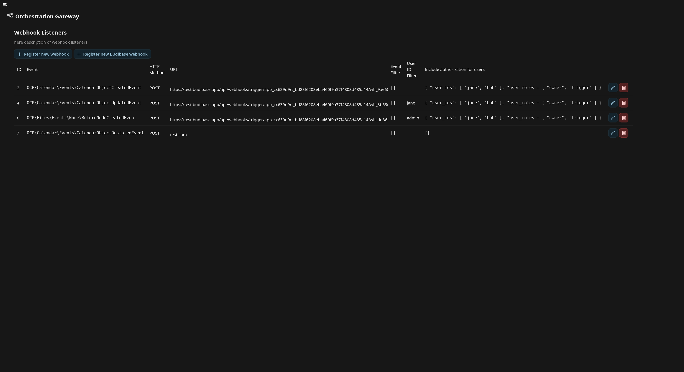
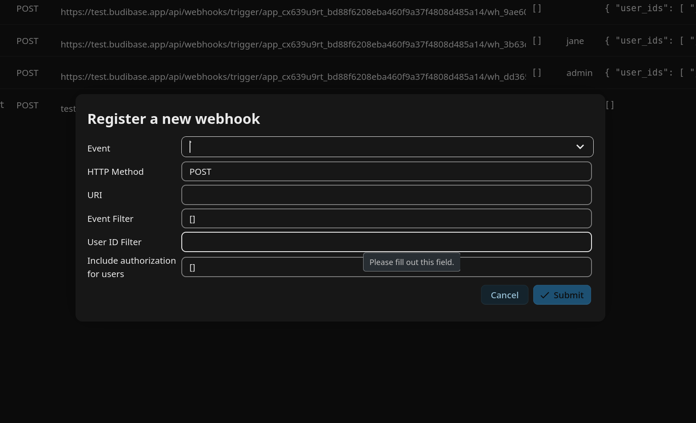

# Orchestration Gateway

A Nextcloud app that provides an admin settings UI to manage webhooks, enabling Nextcloud to trigger automations in external orchestration software.

You can use this app to register, update and delete webhook listeners the the Nextcloud admin settings. Triggers can be set on Nextcloud events from Files, Forms, Tables, Calendar and many more. You can also configure event filters, user ID filters and which authorization tokens to include for every webhook. See the [webhook listeners documentation](https://docs.nextcloud.com/server/stable/admin_manual/webhook_listeners/index.html) for more information.

The app includes a specialized for for for an easy set-up of webhooks with Budibase.

